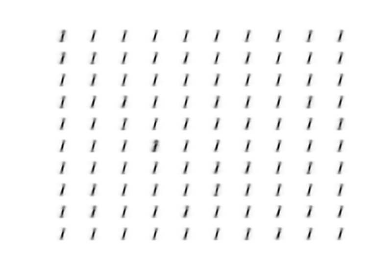

# adversarial_autoencoders

# 準備
MNISTのデータを用意する

```
./data/mnist/t10k-images-idx3-ubyte.gz
./data/mnist/t10k-labels-idx1-ubyte.gz
./data/mnist/train-images-idx3-ubyte.gz
./data/mnist/train-labels-idx1-ubyte.gz
```
# 実行
python adversarial_autoencoders.py

# 結果





